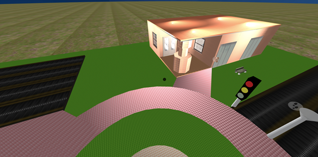
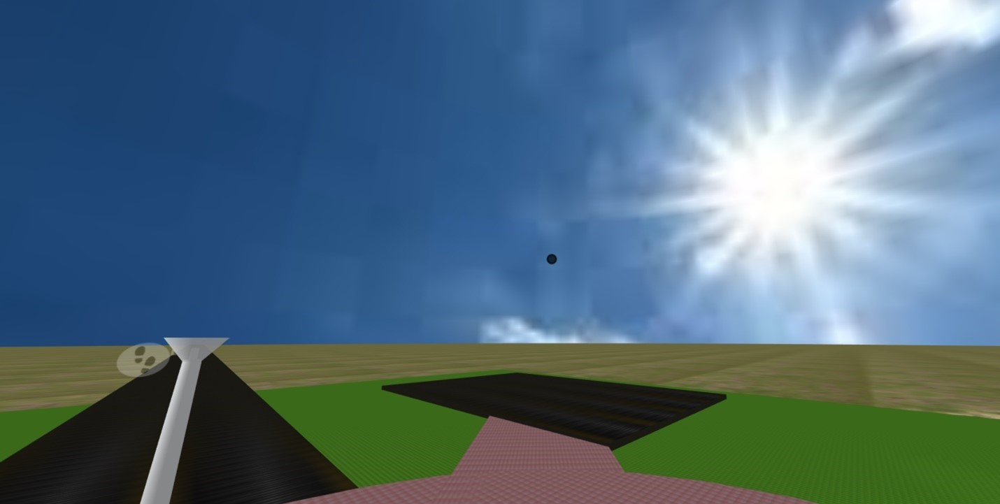
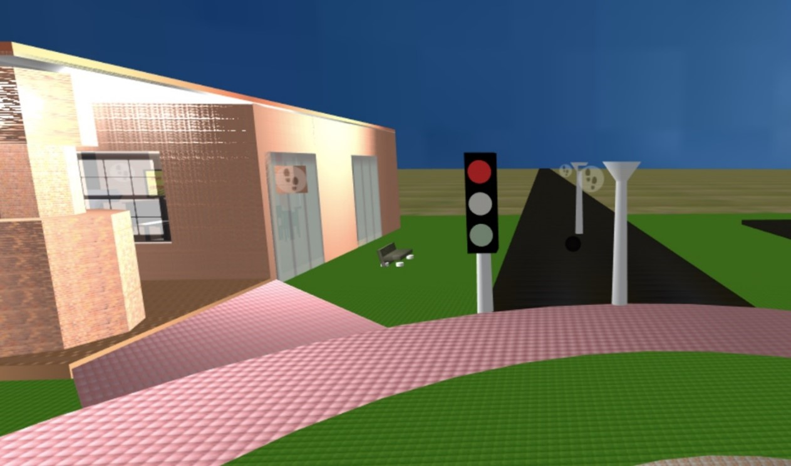
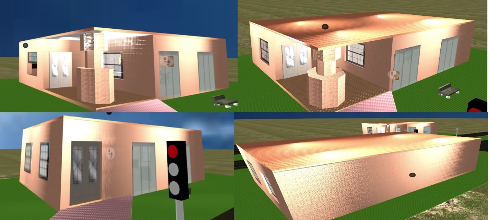
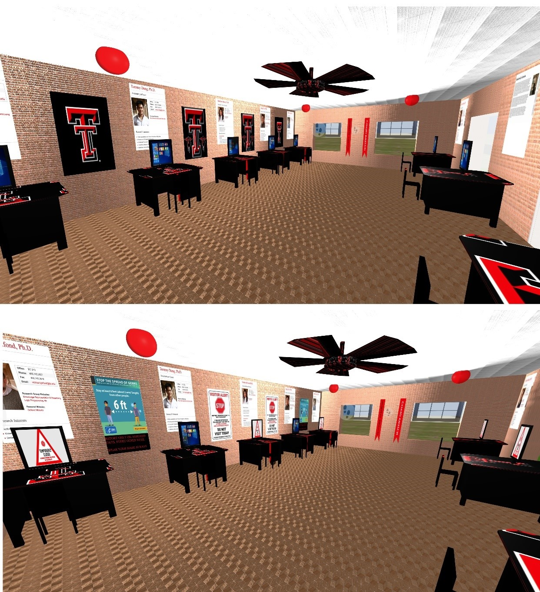
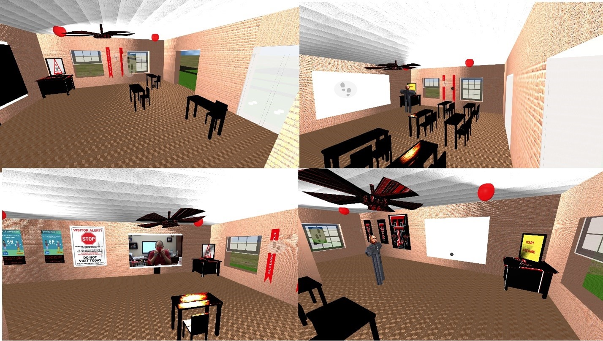

**CS 5331-002 - Virtual Reality Project 1** #
**October 4, 2020 
Umejiaku Promise Afamefuna 
Impact of Coronavirus on my Life Project Report  **
The outbreak of coronavirus has impacted me negatively in several areas of my life. One area it has seriously impacted me is in my academic life. To show this impact I have model a virtual reality environment predominantly using Aframe, Javascript and Blender to design and animate the environment. 
 The areas of impact highlighted in this project was that of changes in the classroom and office environment. It showed that an office that normally sits 8 persons now sits 3 people and they are forced to use a different door for entry and exit and not the one that best suits them. The other area highlighted was that of the classroom environment where a class that normally sits 12 persons is now forced to sit 3 persons. Also, rather than having a lecturer teach course content, they begin by showing a video warning of the impact of Coronavirus. A  picture with a link to the video is shown below. 
[ Click the image below to watch a short video demo.](https://www.youtube.com/watch?v=2r75rA8yok8&ab_channel=AfamefunapromiseUmejiaku)  
 

Click the link below for a live demo. 
https://afamumejiaku.github.io/Classroom/ 
**Libraries Used** 
•	aframe-extras.min.js 
•	aframe-event-set-component.min.js by 
•	aframe-look-at-component.min.js 
•	afame.js 
**I learned the following** 
•	The basics of Three.js, Blender and A-Frame 
•	How the Document Object Model works (DOM) 
•	Front-end design techniques  
•	How to manipulate 3-D .gltf models using blender 
•	General JavaScript library usage 
•	How to use Chrome's web development tools 
•	The meta of WebVR and the existence of cool online virtual reality applications  
**I made all the items used in the project**
  

**Biggest issues** 
•	Smooth Navigation- I was mostly worried about my scene not running smoothly on a mobile device. To compensate for this I made sure to add means of moving in mobile scenes and removed all downloaded materials 
•	Library collision - certain libraries set contradictive variables within one another and this would cause problems with the applications as a whole. For example, the A-Frame Extras Plugin would instantiate movement controls that were supported on a desktop but not on a mobile phone.  
**Description** 
•	The application is written in HTML, JavaScript, and A-Frame. 
**•	OUTSIDE ENVIRONMENT:-  **
**Basic Environment:**- The **Sky** was implement using Aframe Sky Library, the **Ground** was implemented using a plane set at a distance to match the basic Sky distance in Aframe and the **Road** was made using a box primitive to cut across the length of the road. 
  
 <!-- Sky--> 
      <a-sky src="#clear-sunny-sky" rotation="0 0 0"> </a-sky> 
 <!-- Ground | Realistic Style--> 
      <a-plane material="color: #FFFFFF;  src: #floor; repeat: 500 500;  normal-map: #floor-NRM; normal-texture-repeat: 5000 5000" rotation="-90 0 0" scale="10000 10000 1" > </a-plane> 
 <!-- Road -->
      <a-box material="src: #road; repeat: 2 10000; normal-map: #road-NRM;normal-texture-repeat: 10000 10000; normal-scale: 1 1;  roughness: 1.2" height="0.22" width="10" depth="10000" position="0 0.2 0" static-body  >  </a-box> 
**Traffic Light –** The Traffic light was made using a combination of 3 Cylinders, a box and a cone. It was animated to show the changes that normally accompany a traffic light using Aframe Animations library. You can click the image below Street Light to watch a demonstration.  
<!-- Traffic Light  1--> 
      <a-entity position="-5 0 -15">
        <a-cone color="#caccce" radius-bottom="0.4"radius-top="0.2"  height="10"
          static-body  ></a-cone>
        <a-box  color="#000000" depth="1" height="3.5" width="1"  position     ="0 4.2 0" static-body ></a-box>
<a-cylinder  color="#008000"  position="0 3.1 0" radius="0.4" height="1.1" rotation="90 90 90"  static-body
animation="property: material.color; from:#008000; to:#D3D3D3 ; dir:alternate;  loop: true; dur: 9000; easing: easeInOutExpo; delay: 4500"></a-cylinder>
<a-cylinder color="#D3D3D3"position="0 4.2 0"radius="0.4" height="1.1"
rotation="90 90 90" static-body
animation="property: material.color; from:#D3D3D3; to: #FFFF00; dir:alternate;  loop: true; dur: 9000; easing: easeInExpo"></a-cylinder>
<a-cylinder color="#D3D3D3" position="0 5.3 0"radius="0.4" height="1.1"
rotation="90 90 90" static-body
animation="property: material.color; from:#D3D3D3; to:#FF0000 ; dir:alternate;  loop: true; dur: 9000; easing: easeInOutExpo; delay: 4500" ></a-cylinder>
</a-entity>
**Street Light:–** The Street light was made using a combination of 2 Cones only. 
  <!-- Street Light  1-->
 <a-entity position="0 0 -15">
 <a-cone color="#caccce" radius-bottom="0.4" radius-top="0.2" height="10"
 static-body ></a-cone>
<a-cone color="#caccce" radius-bottom="0.2" radius-top="0.7" height="0.7"
position="0 5.3 0" transparent="false" opacity="0.4" static-body
> </a-cone>       </a-entity> 
 [Click the image below to watch a short video demo.](https://www.youtube.com/watch?v=au_s3KO9yzE&ab_channel=AfamefunapromiseUmejiaku) 
  

**Building :–** The building was made using a combination of several Aframe box primitive to make the walls, doors and windows, 3 segmented cylinders primitives were used to make the pillars, and box primitives were used to make the floor, ceiling and roofing as shown in the picture below. The doors and windows were animated using the animation library in Aframe to open and close upon gaze or click. 
<!-- Floor --> 
<a-entity position="25 0.1 25">
<a-box material="src: #classTile; repeat: 30 20;
height="0.4" width="20" depth="30" position="0 0.2 0" static-body> </a-box>
<!-- Ceiling --> 
<a-box material="src: #ceiling; repeat: 20 30;
 height="0.1" width="20" depth="30" position="0 8 0" static-body>
<!-- Roof --> 
<a-box material="src: #roof; repeat: 30 20; height="0.3" width="20" depth="30" position="0 8.11 0" colour="black" static-body> </a-box>
<!—wall in several segments Showing two here --> 
<a-box height="4"  width="10" depth="1" position="5 0 -14.5" src="wall.jpg"
 repeat="20 4" roughness="0.5" static-body></a-box><
<a-box height="4" width="10" depth="1" position="-5 0 -5"src="wall.jpg"
 repeat="20 4"normal-map="#wall-NRM" roughness="0.5"static-body></a-box>
<!—window with animation function --> 
<a-box height="4" width="4" depth="0.5" position="-4 4 14.75" src="window.jpg"
roughness="0.5" opacity="0.7"
animation="property: position; to:-  6 14.5; easing: linear; dur: 3000; startEvents: fusing"
animation__2="property: position; to:- 4 14.75; easing: linear; dur: 3000;startEvents: click"  static-body > </a-box>
<!—Glass Wall --> 
<a-box height="8" width="1" depth="5" position="-9.5 2 -2.5" src="glasswall.jpg"
opacity="0.9" static-body > </a-box>
<!—Door with animation function --> 
<a-box height="6" width="0.3" depth="2" position="0 3 -13" src="door.jpg"
animation="property: rotation; to:0 90 0; easing: linear; dur: 3000; startEvents: fusing"
animation__2="property: rotation; to:0 0 0; easing: linear; dur: 3000;startEvents: click"  static-body ></a-box>
<!—Pillars--> 
<a-entity position="-7.5 0 -12.5"> <a-cylinder src="wall.jpg" repeat="4 2"
Height="4" position="0 4 0" static-body ></a-cylinder> 
<a-cylinder src="wall.jpg" repeat="1 1" normal-map="#wall-NRM" roughness="0.5"
radius="1.5" segments-radial="8" Height="2" position="0 7 0" static-body
></a-cylinder> <a-cylinder src="wall.jpg" repeat="4 2" normal-map="#wall-NRM"
normal-texture-repeat="4 2" roughness="0.5" radius="2" segments-radial="8"
 Height="4" position="0 2 0" static-body ></a-cylinder></a-entity></a-entity>
 

 [Click the image below to watch a short video demo.](https://www.youtube.com/watch?v=2u3ibCEF7rA&ab_channel=AfamefunapromiseUmejiaku) 
  
 
**Car Park:-** The car park was made using the Aframe box primitive 
 <!-- Car Park  1--> 
      <a-entity position="25 0.15 -25">
<a-box material="src: #road; repeat: 4 30;roughness: 0.5"
 height="0.4"    width="20"  depth="30"position="0 0.2 0" static-body ></a-box>
  </a-entity> 
**Round about:-** The roundabout was made using serveral Aframe cylinder primitive and 2 box primitive to form the walk way. 
      <!-- center Grass --> 
<a-cylinder material="src: #grass; repeat: 100 100; normal-map: #grass-NRM;
normal-texture-repeat: 1000 1000 normal-scale: 1 -1; roughness: 0.5" 
position="0 0.3 0" radius="10" height="0.35" static-body ></a-cylinder>
<!-- center --> 
<a-cylinder material="src: #flagTile; repeat: 50 50; normal-map: #flagTile-NRM;
normal-texture-repeat: 50 50 normal-scale: 1 1; roughness: 0.2" position="0 0.35 0"  radius="5" height="0.4"  static-body></a-cylinder>
<!-- Round About  --> 
<a-cylinder material="src: #tile; repeat: 100 100; normal-map: #tile-NRM;
position="0 0.2 0" radius="15" height="0.35" static-body ></a-cylinder>
<!-- walk way 1 --> 
<a-box material="src: #tile; repeat: 40 100; normal-map: #tile-NRM; normal-texture-repeat: 40 100;"  height="0.3" width="7" depth="60" position="0 0.2 0"
rotation="0 45 0" color="#ffffff" static-body>  </a-box> 
**Bench:-** The Bench outside was made using two Aframe Box Primitives and 4 cylinders primitives as the legs. 
**INSIDE ENVIRONMENT:-  
Office:-** The Office contained **Wall Portraits and their areas of specialization of several lectures made in Aframe**, it also contains **Chairs, Desk and Fan made in Blender**. The wall frames made using TTU logo transforms to Covid warning signs and several work stations are closed down during the coronavirus period. The Computers were made using Aframe Box Primitives and the image primitive. 
<!—Importing the Desk --> 
<a-entity gltf-model="#desk" rotation="0 -90 0" scale="0.65 0.6 0.65"
position="9 -1.4 5">
<!-- Computer --> 
<a-entity position="3.7 6.5 2.5" scale="1.5 3 1" >
<a-box color="black"depth="0.3"height="0.1"width="0.5"position="0 0 0"></a-box>
<a-box color="black"depth="0.1"height="0.3"width="0.2"position="0 0.2 0"></a-box>
<a-box color="black"depth="0.1"height="0.9"width="1.3"position="0 0.6 0">
<a-image id="screen1"src="#welcome"position="0 0 0.051" width="1.1" height="0.8"
 ></a-image>  </a-box> </a-entity> </a-entity>
<!—Importing the Chair --> 
<a-entity gltf-model="#Chair"rotation="0 90 0"scale="0.4 0.4 0.4" position="4.2 0 9.3"static-body></a-entity>
<!—wall Frame --> 
<a-box material="src: #tommy"position="-9.1 5.7 6.25" height="4"width="0.3"
depth="2" shader="flat"> </a-box>

 

 
**Classroom:**- The Classroom contained **Wall painting of TTU, a Lecture desk equipped with a computer that plays a sound mimicking a lecture, a White board, a TV screen made in Aframe, and also contains 12chairs, 6 tables and fan made in Blender.** The wall painting made using TTU logo transforms to Covid warning signs and several table and chairs disappear as well as the lecturer and the computer on the lecturers desk is disabled but the whiteboard turns into a television with the player beneath it.  
 
 
###Video and Audio Lecture – The Video and audio was inserted using were inserted using the Aframe primitive for audio and video but to make it work effectively, I had to add the Play and Pause features using JavaScript. 

     
##References 
•	https://aframe.io/ 
•	Danilo Pasquariello. Design and prototype cross-platform virtual reality experiences April 2020 
•	Don McCurdy data visualization, and graphics. https://github.com/donmccurdy

